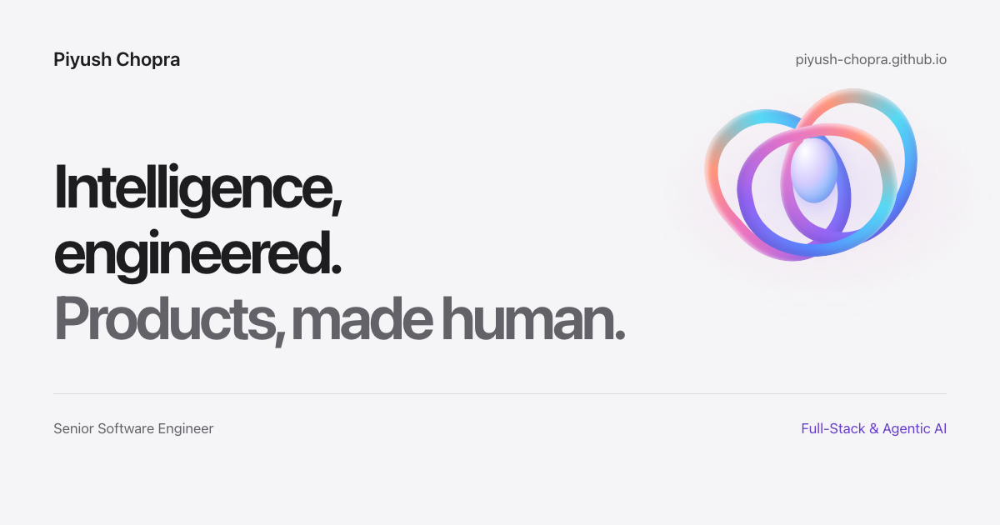

# Piyush Chopra — Portfolio

A static portfolio for Piyush Chopra, Senior Software Engineer focused on full-stack engineering and agentic AI.

The visual direction pairs Apple-inspired system typography and silver/graphite surfaces with an original Siri-inspired spectrum sculpture. Project content stays on solid surfaces; the floating navigation uses a restrained translucent treatment. Both appearances follow system preferences by default. See [design decisions and HIG references](docs/design.md).



**Live website:** https://piyush-chopra.github.io/

## Local preview

No build step or runtime dependencies are required.

```bash
python3 -m http.server 4173 --bind 127.0.0.1
```

Open http://127.0.0.1:4173.

## Structure

- `index.html`: semantic, indexable page content, project summaries, experience, contact, and structured metadata.
- `styles.css`: responsive layouts, light/dark themes, reduced-motion and print styles.
- `script.js`: progressive enhancements for theme switching, project filtering, email copying, and active navigation.
- `assets/`: project screenshot, favicon, social preview image, and legacy licensed font asset.
- `404.html`, `robots.txt`, `sitemap.xml`: hosting and discovery essentials.

Content remains readable and links work without JavaScript. Project filters and clipboard controls appear only when supported. There are no analytics scripts, contact-form backend, or third-party font requests.

## Publishing

GitHub Pages publishes the root of `main` in `piyush-chopra/piyush-chopra.github.io`. The `.nojekyll` file bypasses Jekyll. Push changes to `main` and wait for the Pages deployment to finish.

## Updating content

Edit the corresponding semantic section in `index.html`. Update social metadata and `assets/social-card.png` if the positioning changes. The source for the social card is in `scripts/social-card.html`.

Professional experience and approximate outcomes were supplied in Piyush's September 2026 resume. Public project descriptions were checked against their repositories. Enterprise projects are summarized without publishing internal source or data. The original resume PDF and phone number are not included in this repository.

## Checks

The site is checked at mobile, tablet, and desktop widths; in both themes; with 200% text, increased contrast, reduced transparency, reduced motion, and JavaScript disabled; and for navigation, filtering, details, clipboard handling, missing local assets, and basic accessibility. Screenshots used during verification are kept outside the published repository.

With the local preview server running, install the optional development tools and run the browser checks:

```bash
npm ci
npm test
```

Google Chrome is used by default. Set `CHROMIUM_PATH` to use another Chromium executable. To check a deployment, run `PORTFOLIO_BASE=https://piyush-chopra.github.io npm test`. Generated screenshots and results are written to the ignored `artifacts/` directory. The checks include axe WCAG A/AA audits; these supplement manual accessibility review.

To regenerate the social preview from its HTML source, run `npm run social-card` while the local server is running. None of these development dependencies are loaded by the website.

## Credits

The site uses the platform system font. The previously used Manrope asset remains bundled under the SIL Open Font License; see `assets/fonts/OFL.txt`.
The Foundry Office screenshot shows its actual interface with example data. Character graphics within that screenshot are by Penzilla Design; see the [Foundry Office third-party notices](https://github.com/piyush-chopra/foundry-office/blob/main/THIRD_PARTY_NOTICES.md).
